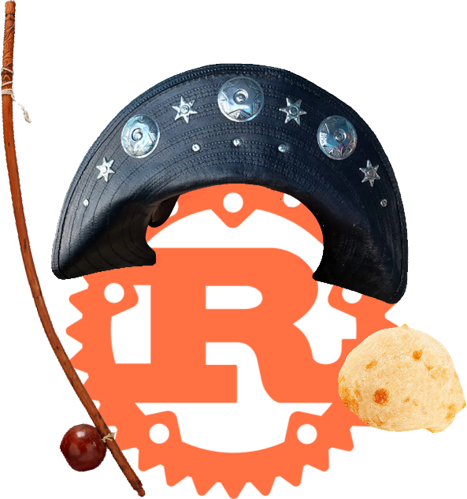

# ferrugem



Aren't you _cansado_ from writing Rust programs in English? Do you like saying
"merda" a lot? Would you like to try something different, in an exotic and
funny-sounding language? Would you want to bring some Potuguese touch to your
programs?

**ferrugem** (Portuguese for _Rust_) is here to save your day, as it allows you to
write Rust programs in Portuguese, using Portiguese keywords, Portuguese function names,
Portuguese idioms.

This has been designed to be used as the official programming language to
develop the future Brazilian sovereign operating system. 

If you're from the Brazilian or any other governement with Portuguese as an official 
language: I will be awaiting your lightning donations on **zap@luisschwab.net**.

You're from Angola (or elsewhere) and don't feel at ease using only Portuguese words? 

Don't worry!
Portuguese Rust is fully compatible with English-Rust, so you can mix both at your
convenience.

Here's an example of what can be achieved with Ferrugem:

### trait and impl (aka convenção e realização)

```rust
ferrugem::ferrugem! {
    externo caixote ferrugem;

    use std::collections::Dicionário;

    convenção ChaveValor {
        função escrever(&eu, chave: Corda, valor: Corda);
        função ler(&eu, chave: Corda) -> Resultado<Opção<&Corda>, Corda>;
    }

    estático mutável DICIONÁRIO: Opção<Dicionário<Corda, Corda>> = Nenhum;

    estrutura Concreta;

    realização ChaveValor para Concreta {
        função escrever(&eu, chave: Corda, valor: Corda) {
            deixa dicionário = perigoso {
                DICIONÁRIO.pega_ou_insere_com(Padrão::padrão)
            };
            dicionário.inserir(chave, valor);
        }
        função ler(&eu, chave: Corda) -> Resultado<Opção<&Corda>, Corda> {
            se deixa Algum(dicionário) = perigoso{ DICIONÁRIO.como_ref() } {
                Beleza(dicionário.pega(&chave))
            } ou_então {
                Errou("busca o dicionário!".transforma())
            }
        }
    }
}
```

### Support for regional languages

```rust
#[permite(código_inacessível)]
função secundária() {
    fudeu!("fudeu!");
    deu_merda!("deu merda!");
    eita!("eita!"); // in SFW contexts
}
```

### Other examples

See the [examples](./examples/src/main.rs) to get a rough sense of the whole
syntax. Voilà, that's it.

## les contributions

First of all, _muito obrigado_ for considering participating to this joke, the
Brazilian government will thank you later! Feel free to throw in a few identifiers
here and there, and open a pull-request against the `mestre` (Portuguese for
`master`) branch.

## but why would you do zat

- horsin around
- playing with raw proc macros
- making a bit of fun about programming languages that do this seriously,
  though I can see their utility.
- winking at [Marcel](https://github.com/brouberol/marcel)
- c'est chic

## Other languages

- Dutch: [roest](https://github.com/jeroenhd/roest)
- German: [rost](https://github.com/michidk/rost)
- Polish: [rdza](https://github.com/phaux/rdza)
- Italian: [ruggine](https://github.com/DamianX/ruggine)
- Russian: [Ржавый](https://github.com/Sanceilaks/rzhavchina)
- Esperanto: [rustteksto](https://github.com/dscottboggs/rustteksto)
- Hindi: [zung](https://github.com/rishit-khandelwal/zung)
- Hungarian: [rozsda](https://github.com/jozsefsallai/rozsda)
- Chinese: [xiu (锈)](https://github.com/lucifer1004/xiu)
- Spanish: [rustico](https://github.com/UltiRequiem/rustico)
- Korean: [Nok (녹)](https://github.com/Alfex4936/nok)
- Finnish: [ruoste](https://github.com/vkoskiv/ruoste)
- Arabic: [sada](https://github.com/LAYGATOR/sada)
- Turkish: [pas](https://github.com/ekimb/pas)
- Vietnamese: [gỉ](https://github.com/Huy-Ngo/gir)
- Japanese: [sabi (錆)](https://github.com/yuk1ty/sabi)
- Danish: [rust?](https://github.com/LunaTheFoxgirl/rust-dk)
- Marathi: [gan̄ja](https://github.com/pranavgade20/ganja)
- Romanian: [rugină](https://github.com/aionescu/rugina)
- Czech: [rez](https://github.com/radekvit/rez)
- Ukrainian: [irzha](https://github.com/brokeyourbike/irzha)
- Bulgarian: [ryzhda](https://github.com/gavadinov/ryzhda)
- Slovak: [hrdza](https://github.com/TheMessik/hrdza)
- Catalan: [rovell](https://github.com/gborobio73/rovell)
- Corsican: [rughjina](https://github.com/aldebaranzbradaradjan/rughjina)
- Indonesian: [karat](https://github.com/annurdien/karat)
- Lithuanian: [rūdys](https://github.com/TruncatedDinosour/rudys)
- Greek: [skouriasmeno](https://github.com/devlocalhost/skouriasmeno)
- Thai: [sanim (สนิม)](https://github.com/korewaChino/sanim)
- Swiss: [roeschti](https://github.com/Georg-code/roeschti)
- Swedish: [rost](https://github.com/vojd/rost/)
- Croatian: [hrđa](https://github.com/njelich/hrdja)
- Persian: [zangar (زنگار)](https://github.com/ui-ce/zangar)
- Malagasy: [arafesina](https://github.com/luckasRanarison/arafesina)
- Latin: [ferrugo](https://github.com/pianoman911/ferrugo)
- Norwegian: [korrosjon](https://github.com/datagutt/korrosjon)
- All of the above: [unirust](https://github.com/charyan/unirust)
